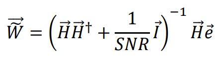

# Channel Estimation
Estimation of the channel coefficients is an important concept before equalizer design since the design depends on channel coefficients. As one can see from the figure below, the channel changes between each communication nodes and thus in each communication round, the estimation of the channel may be required for reliable communication. Representing the overall channel as a mathematical model in a finite length vector is quite fortunate for system design in digital communications because it makes almost any latter algorithm less complex, more accurate and more feasible in the run time. There are several channel estimation algorithms such as Least Mean Squares and Recursive Least Squares algorithms. For the sake of simplicity and conciseness, Maximum Likelihood Single Shot Estimation algorithm was chosen to be implemented in this project.

## Maximum Likelihood Single Shot Estimation
During channel estimation , several pilot symbols known by both the receiver and the transmitter are sent through the channel through which the information will pass, and the unknown coefficients of channel are estimated by maximum log likelihood method
One can model the received pilots by the receiver as follows:

where y is incoming signal, h is channel vector, x is pilot symbol sequence and η is noise for that time instant. To utilize MATLAB’s fast matrix operations, one can represent the summation given above as a matrix multiplication between channel vector and sliding pilot symbols. One should note that sliding pilots should be in reverse order since channel vector is not flipped in the convolution as shown in the formula above. Say we send 3 known pilot symbols.

size of X is = (channel length+pilot numbers-1) x channel length

It is known fact that **η** vector is independent and identically distributed Gaussian random variable with μ = 0, σ². Since **𝑋**, **𝐻** vectors are deterministic, **𝑌** is also i.i.d. Gaussian random variable with mean vector **μ**= **𝐻**𝑥**𝑋**, σ².

This is the likelihood function. Then, one can take log likelihood by taking ln of this function owing to the monotonicity of log function following equation is got.

This is the likelihood function and one can maximize this function by optimizing over channel coefficients as the following

This equation gives the channel coefficients that we are looking for the MMSE equalization. The formulation of the MMSE equalization can be directly got from the [book](https://books.google.com/books/about/Digital_Communications.html?id=HroiQAAACAAJ#:~:text=Digital%20Communications%20is%20a%20classic,depth%20to%20cover%20two%20semesters.), which is:

## Implementation Details

The script is  built to realize Monte-Carlo simulation for unknown channel with different number of pilot symbols at each data frame being ransmitted and the BER is measure via 10-tap causal MMSE equalizer. Monte-Carlo simulation is run for each predetermined pilot symbols. After all these imulations, another BER calculation with ideal channel is run. The latest boolean argument of the simulation function determines whether channel is 
known or need to be estimated before equalization.

Number of symbols per transmitted frame is selected to be 5000. Maximum number frames is selected to be 2000. The error limit is selected to be 200. In the Monte-Carlo simulation, the simulation is run for each predetermined SNR 
values and it keeps running until the condition:
(nTransmittedFrames(nEN)<max_nFrame)&&(nErroneusFrames(nEN)<fErrLim) 
is destroyed. After generation of information frames, additional lines are added to generate pilot symbols with specified size. Random bits are generated to be our training symbols. Then resulting pilot symbols are sent
through channel. After receiving the pilot signals, the channel is estimated by the formula derived above. After estimation of the channel, 10-tap causal MMSE equalizer matrix is produced. Causal equalizer is produced because channel is known to be causal. Only design difference between ordinary and causal equalizers is its unit 𝑒⃗ vector has only 1 at the first row unlike its being in the middle in the non-causal ones. Besides this difference, the size of the H matrix is decreased from (N1+N2+M1+M2-1) to (N2+M2-1) automatically without any design change. Finally, the equalization is done on the incoming signals and corresponding bit error rates and least square errors are calculated.

## Simulation Results

BER curves of the simulations with maximum log likelihood estimated channel with specified number of pilots and causal 10-tap MMSE equalizer shown in the figure above. The BER with the green line is the BER of the ideal channel with no estimation. 

As one can see from the figure above, the BER curve becomes closer to the one with the ideal channel as the number of pilots for estimation increases. It is quite an expected result because receiver have more information about the channel as the number of pilots increases. It is noted that the BER curve shifts more when number of pilots increases from 3 to 5 than it increases from 10 to 20. It is expected result because the pilots increases accuracy drastically until pilot number exceeds the number of channel coefficients. Thus, we see a significant increase between # pilots 3 and # pilots 5 than the successive ones. Additionally, the pilot vector longer than the channel vector may be used for fixing the effect of the noise. In other words, if there is no noisy situation, 5 pilots would be quite enough and fast to get desired accuracy while more pilots may enhance the performance in the noisy conditions. Finally, the effect of the number of pilots obvious in high SNR values simply because channel cannot be estimated correctly in noisy conditions even if there are lots of pilots for the estimation. 

Besides the BER curves, the least square error between the estimated and the original channel is shown in the plot above. It is for sure that pilot numbers affect the channel estimation performance in a positive way in contrast to noise power. 

